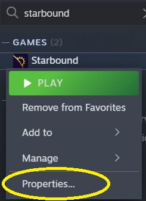
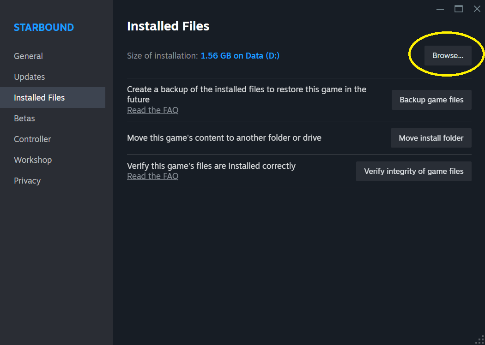
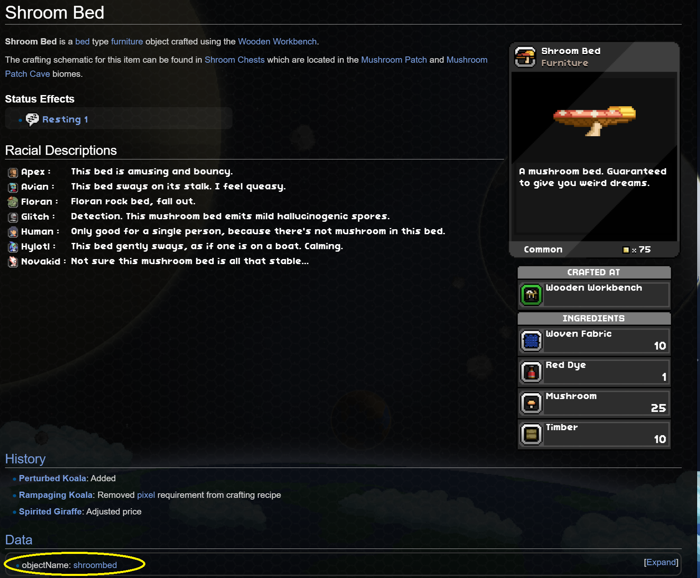
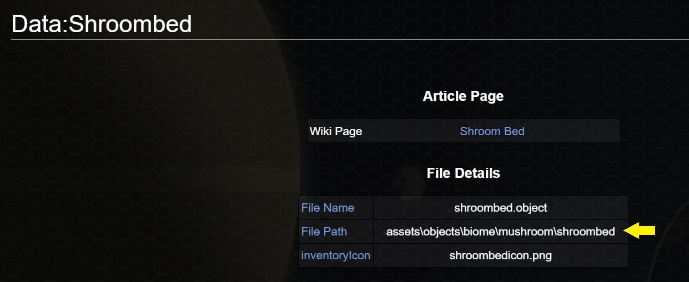
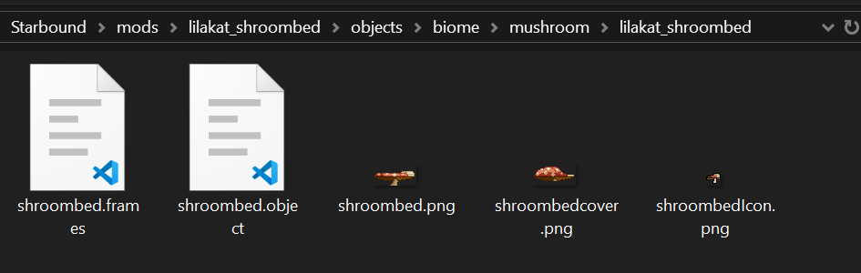
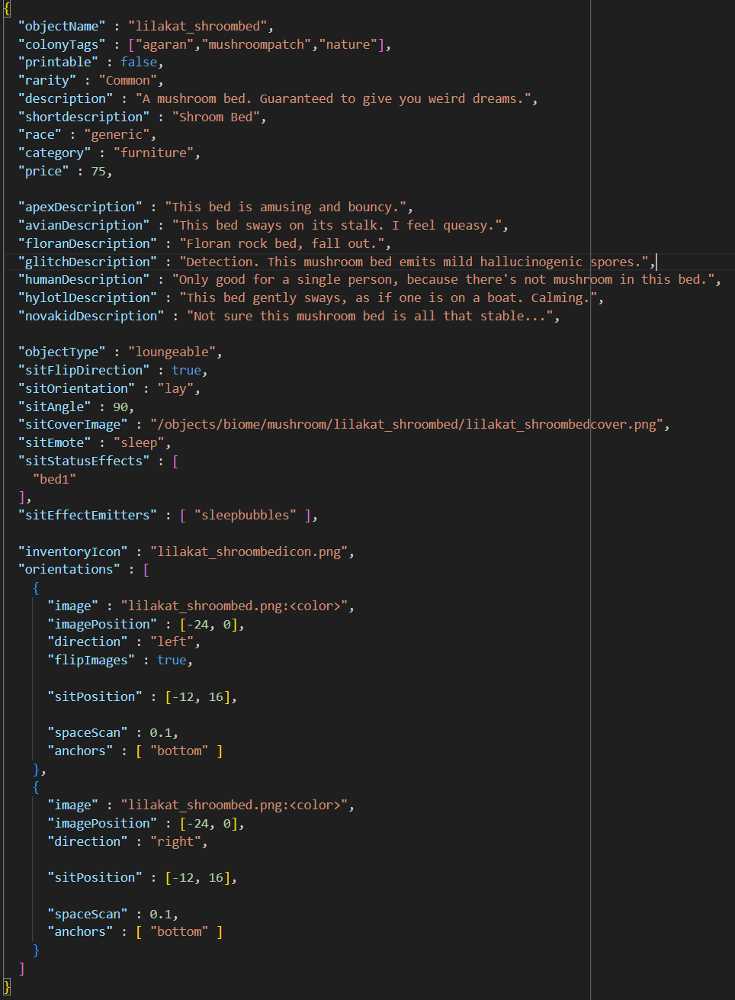

# How to create mods for Starbound (no coding experience required)

Open the location of the Starbound game files. If you use Steam, this is the easy way: Right click on Starbound and open properties. Click 'Installed Files' then 'Browse':

  

---

If you're on windows, shift+right click in the folder and open in terminal or powershell. Now type:
``` bash
.\win32\asset_unpacker.exe .\assets\packed.pak .\UnpackedAssets\
```

Now drag the UnpackedAssets folder onto your desktop or wherever you want to work from. 

While you're in this folder, create or go to the folder called 'mods'. Create a new folder in here called whatever you want your mod to be called and remember where this location is. 


# Finding the files to mod

Now it's time to find the files you want to mod. In this example we'll change the appearance of the wave bed. Go to the [Starbound Wiki](https://starbounder.org/Starbound_Wiki) and locate the object. Scroll to the bottom of its page and you'll see a section called Data that has the object's name in it. 

 

Click on it and it'll tell you where in the game files the object is located (except 'assets' is our UnpackedAssets folder now). Note the file path. 

 

Remember the folder you created in the mods folder? Go there and create subfolders for the entire file path, starting from whatever comes after 'assets'. So in this case, create a folder called 'object' and in that, create another folder called 'themed', in that create *another* folder called 'wave', and in that create *yet another* folder called 'wavebed'. ~~Congrats, you're done making folders for this project.~~ Go into the final subfolder and copy in the pngs you want to change. Use some kind of sorcery to edit them and you're done. When you launch Starbound, they should look like the new images instead!

---

Now, generally you shouldn't do what I just explained, especially if you want to share your mod with others. Instead, you should just create your own version of the object to change (it's not much harder, I promise). 

To create your own version of this bed, rename your 'wavebed' folder to something else that doesn't exist already, I'll use 'lilakat_wavebed'. It's good to use a prefix like 'lilakat_' on your mods so they don't conflict with other people's. Copy everything from '/UnpackedAssets/objects/themed/wave/wavebed' into '/mods/objects/themed/wave/lilakat_wavebed', and change every reference to 'wavebed' in all the filenames to 'lilakat_wavebed'. Now open lilakat_wavebed.object in your favourite text editor and change every reference to 'wavebed' into 'lilakat_wavebed' (using find and replace in VScode works great if you don't want to do it manually and worry about forgetting a reference!). You can also change the descriptions and anything else you want.

To recap, your mod folder should look like this now: 

 

and your .object file should look like this:

 

In game you can now spawn your new object by opening the console and typing '/spawnitem lilakat_wavebed 1'.


# Uploading to Steam

Note: please almost never do this if you've changed actual game files instead of patching them or adding new objects. You will break other people's mods that rely on the game files you've changed.

If you want to upload your mod to steam, create an image for your mod and put it in your project folder. Go to Starbound on Steam, then click 'Play' and select the mod uploader tool. If you don't have options when you hit play, go to properties, and under 'General', change your launch options to 'Ask when starting game'. 


